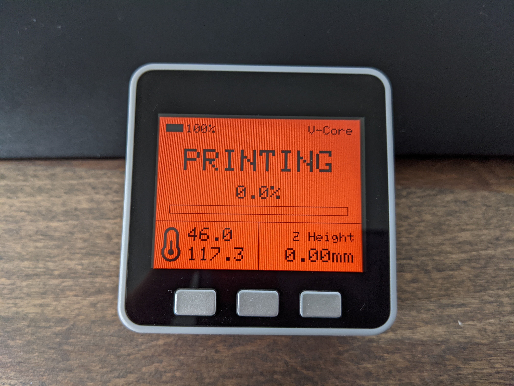

Duet Buddy is a companion M5Stack app for the duet3d family of 3D printer controllers.

NOTE: The Duet Buddy project has been moved to https://github.com/richard-mckenna/duet_buddy

&nbsp;

&nbsp;

